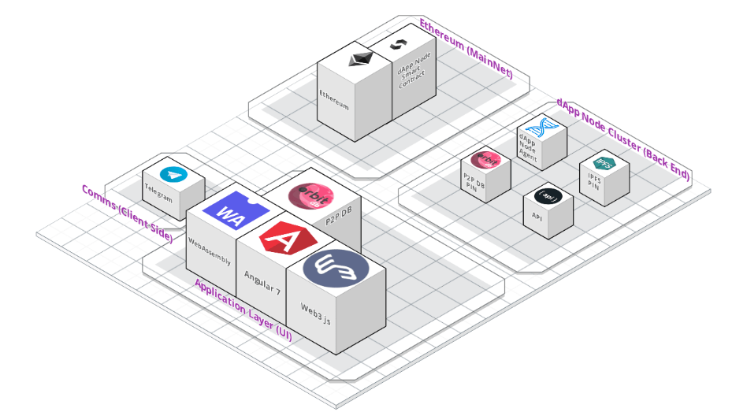

## Trustless software artifacts

### Requirements
1. Provide functionality traditionally given by centralised servers 
1. Allow for verifiable DApp node components
1. Ensure that DApp node contents are honest and secure by design
1. Allow trustless access to application resources

<!-- ### DApp node contents validation 
- Some lookup against checksum of architecture
- Incentivised to maintain correct data and provide honest storage as outlined in [the DAO](dao.md)
- Validate contents of a single Docker container to reduce the overhead

### Additional
DApp nodes must
> provide a minimum level of bandwidth and storage to the network, being responsible for pinning data and storing files on decentralised db

> After the investor is able to meet the purchase and other requirements, he is granted access to a full node, and then he can start thinking of the profits. -->
